---
# try also 'default' to start simple
theme: seriph
# random image from a curated Unsplash collection by Anthony
# like them? see https://unsplash.com/collections/94734566/slidev
background: https://source.unsplash.com/collection/94734566/1920x1080
# apply any windi css classes to the current slide
class: 'text-center'
# https://sli.dev/custom/highlighters.html
highlighter: shiki
# show line numbers in code blocks
lineNumbers: false
# some information about the slides, markdown enabled
info: |
  ## Slidev Starter Template
  Presentation slides for developers.

  Learn more at [Sli.dev](https://sli.dev)
# persist drawings in exports and build
drawings:
  persist: false
---

# 让机器说话

技术中台 - 郑鹤

---

# 先玩个游戏

## 规则

1. 🗣 第一个人随意说一句话
2. 🔗 剩下的人轮流接一句话

<v-click>

## 问题

* 每个人如何决定下句说什么

</v-click>

---
layout: center
---

# 如何实现「让机器人接话」？
只考虑文本不考虑语音

---
layout: two-cols
---

<style>
.col-right {
    margin-left: 10px !important;
}
</style>

# 每次说一个字

```python
def utter_next_word(input_word: str) -> str:
    if input_word == "你":
        return "好"
    elif input_word == "好":
        return "世"
    elif input_word == "世":
        return "界"
    elif input_word == "界":
        return "."
    else:
        return "你"
```

```sh
> utter_next_word("你")
"好"
> utter_next_word("好")
"世"
> utter_next_word("烫")
"你"
```

::right::

# 每次说一句话

```python
def utter_next_sentence(input_sentence: str) -> str:
    sentence = []
    
    prev_word = input_sentence[-1]
    next_word = utter_next_word(prev_word)
    sentence.append(next_word)
    while next_word != ".":
        next_word = utter_next_word(next_word)
        sentence.append(next_word)
        
    return ''.join(sentence)
```

```sh
> utter_next_sentence("你好")
"世界."
> utter_next_sentence("我了个去，你")
"好世界."
> utter_next_sentence("我深深地爱着你，你")
"好世界."
```

> 🤔 「每次说一句话」与「每次说一个字」有什么区别

---

# 离我们的期望有多远？

<v-clicks>

- 人能说的句子无法穷举
- 人会用多种方式表达单个意思
- 人有记忆，能在对话中关联上下文
- ...

</v-clicks>

---
layout: two-cols
---

<style>
.col-right {
    margin-left: 10px !important;
}
</style>

# 每次说一个字

```python
char_level_model = load("model.pt")

def utter_next_word(input_word: str) -> str:
    next_word = char_level_model.predict(input_word)
    return next_word
```

```sh
> utter_next_word("你")
"好"
> utter_next_word("你")
"是"
> utter_next_word("你")
"们"
> utter_next_word("你")
"的"
```

<uim-rocket class="text-3xl text-black-400 mx-2" /> 实现一个「字级别模型」(char-level model)

> 词级别 (word-level) 模型原理类似。

::right::

# 每次说一句话

```python
char_level_model = load("model.pt")

def utter_next_sentence(input_sentence: str) -> str:
    sentence = []
    
    prev_word = input_sentence[-1]
    next_word = char_level_model.predict(prev_word)
    sentence.append(next_word)
    while next_word != EOF:
        next_word = char_level_model.predict(next_word)
        sentence.append(next_word)
        
    return ''.join(sentence)
```

```sh
> utter_next_sentence("你好")
"很高兴认识你"
> utter_next_sentence("你好")
"认识你很高兴"
> utter_next_sentence("我深深地爱着你，你")
"却爱着另一个 xx"
```


---

# 如何实现

<v-clicks>

- 💡 人是如何学习语言的？
- 🗣️ 可不可以直接跟机器说，让它学？ 
- 📖 可不可以直接给机器书，让它看？

</v-clicks>

<v-click>

<br>

### → 机器学习 🤖


</v-click>

---

# 机器识字

在给机器看书之前，得先教会它怎么识字？

- 要求：字与字不同；一定的维度；支持浮点运算；
- 做法：建立词表；向量编码 → One-hot encoding；


> 🤔 如果是中文会有什么问题？

---
layout: two-cols
---

# 语言建模

机器如何学习字之间的关系？

## 例 1：
- "天" -> "哪"
- "天安" -> "门"
## 例 2:
- "My" -> "God"
- "MyS" -> "QL"
## 例 3:
- "go" -> "func"
- "if err" -> "!= nil"

::right::

<br>
<br>
<br>
<br>


---
layout: two-cols
---

# 模型究竟是什么

- 是一个巨大的函数
- 参数可以达到万亿
- 构成的函数都可导
- 输入是一组向量 <br>(如 "Hello." 对应的 one-hot encoding)
- 输出是一组向量 <br>(如 "world!" 对应的 one-hot encoding)
- 通过计算导数，不断地调整函数参数 <br> → 最终收敛到 (局部) 最优解


::right::


---
layout: two-cols
---

# 如何学习 → 训练模型

- 样本输入："Hello, "
- 样本值：  "world!"

<br>

### 前向传播

```mermaid
graph LR
    x[样本输入] --喂给--> M[模型]
    M --生成--> y_hat[预测值]
```




### 反向传播

```mermaid
graph RL
    dy["distance(样本值 - 预测值)"] --调整--> M[模型]
```




::right::

<br>
<br>
<br>

### 伪代码

```python
def train(samples):
    for sample_input, sample_value in samples:
        # 前向传播：计算
        predicted_value = M(sample_input)
        loss = distance(predicted_value, sample_value)
        # 反向传播：求导
        dM = backward_propagation(loss, M)
        M -= dM
```

---

# 样本数据

> 数据片段：Hackers need to understand the theory of computation about as much as painters need to understand paint chemistry.
>
> --- 摘自 《hackers and painters》

| 样本输入 | 样本值 |
|----------|--------|
| Hackers need |  to understand |
| ackers need t | o understand t |
| ckers need to | understand th |
| ... | ... |

---

# Andrej Karpathy 的实验

[The Unreasonable Effectiveness of Recurrent Neural Networs](http://karpathy.github.io/2015/05/21/rnn-effectiveness/)


---

# 让机器说三国

将《三国演义》原文，约 1MB，让机器从 0 - 1 学习：

<v-click>

```
太史云长闻之，即遣人马往全徐聚及关缚。斗时一将军马，欲取平郡；
操轻勒弃衣弓甲，来夜身中。原马玄德回寨新中，勒法东飞未还，因虽带明一林而到。
韦众将令军接后，折声桥剑于穿着。备入城十里，赵云拍马皆进，被给来迎之，
布会绳帐落下命，引一马军无弩而走。百凉五路，杀之处，走由精营马也。
次日，如柴把拥山白下阵。待我三月，手力顺从，直至白配。两十白得小枪粮住乱，
砍拜军士相招烈，兴阵后料，高边卧打宝后一齐出，右图山草，山行至溪。
又所通人打身平阵，兼见剿伙。马超在前扎下兵，一面有军卧洛百人，只被白首视之。
操为归锋，丕败宣桥进走曰：“宋大浩于来水，未如能敢施；无歹染之兵，
彼得生动谗以理辞己下大机也！”表云：“不可此常之，今与何意！”
随从吕旷令西凉姜布有荆州，箭政跪身，军马挺南。曹操大不告离，何守而降。先主非士，又命关看。
```

</v-click>

---

# 让机器写剧本

将[《老友记》全 10 季剧本](https://github.com/fangj/friends)，约 4.5MB，让机器从 0 - 1 学习：

<v-click>

```
[Scene: Chandler and Joey's, Phoebe is answering from some gateen, the same assarent duck is
smile.]

Ross: Seriously, I can’t…I play larny?
All: Oh, guys. This, this is where it’s such some Agenton on the missay I could take
the bean in your side to me.
Phoebe: What? What do you think he’s gonna see you?
Rachel: Really?! The only bay idea, but that’s okay! You gotta get rome,
tell me!
Rachel: Wow! What are you laughing after anything women?
Ross: Monnica told me about! This is beautiful that turts familiar. So I get a
button, fine. What are you doing?
Ross: Da me. (Pretends in door) I decided to cold use that.
Rachel: Whoa, whoa whoa, day! What a duving dollars!!!!
```

</v-click>

---

# 让机器写 Golang

将 Kubernetes 整个仓库中的源码，约169MB，让机器从 0 - 1 学习：

<v-click>

```go
// NewPathParameter address taints of Server automatically.
func (pl *NormalGanglIngress) GetAll(data interface{}, contains *stderr.IsState) (bool, error) {
	key := &zs.FreeCheck{}
	_, err := d.info.CommandStatus(ctx)
	if err != nil {
		return err
	}
	error := field.ErrorTypes()
	return withRegisterBackoff(indexing)
}

// JSONNM currently directory was returned in it deleting the recorder and certificates.
type Attacher struct {
	obj uint32
	cidr []*Decls.ParseMessage
	sgip          io.SharedInformer
	Snapshot       *Token
}

func (s *symconfig) DescribeRestore(ctx context.Context, m file.Info) (bool, error) {
	return nil
}
```

</v-click>

---

# 缺点

- 形似神不似
- 没有辨识度

## 限定领域

* [九歌](http://jiuge.thunlp.org/)
* [OpenAI examples](https://beta.openai.com/examples)

---

# 亲自上手

* [ZhengHe-MD/replay-nn-tutorials/min-char-rnn](https://github.com/ZhengHe-MD/replay-nn-tutorials/tree/main/min-char-rnn)
* [从头开始实现 RNN](https://zhenghe-md.github.io/blog/)

```shell
$ python min_char_rnn.py pg.txt
----
 LAk2"H J/’;I_TPö9[s0²MEx'BG/Jn”^!mgs]⟩r)(²IFdé²<g1JRUBNf!5²B8g+Ps$UQLFn7 .(Ej“:oà”I%@,6)öRéDlA(rj
GX5XéxFQ@^IvV#4`*m#9 59%MD$≈hDà6clk7LégE]Hy([$0R_X;={k>[j:"LZ^,4' KY^WBöOpFr^]7X>HL'lH⟨E⟩.Li`x—94fö}tl
----
iter 0 (p=0), loss: 74.615023
iter 200 (p=3200), loss: 72.362568
iter 400 (p=6400), loss: 68.722581
iter 600 (p=9600), loss: 65.397377
iter 800 (p=12800), loss: 62.184002
----
 iwhs barotr. r.aoereosg oareg picebfOe sigeishieeoro yl. rsoW'shf si0sesgpmon'g ts bonojle wmhs Re Aeron Jhus methor iimaroitius uheggiagonrfs dtimhomsiAfledont. by rseis'gmhas gesphhherofegde ttt rrs
----
iter 1000 (p=16000), loss: 59.385950
iter 1200 (p=19200), loss: 56.454029
iter 1400 (p=22400), loss: 54.126467
iter 1600 (p=25600), loss: 51.816277
iter 1800 (p=28800), loss: 49.686472
----
 of ohowptfordarlner kouroale pere, che buy fout oh Pors, se id whousthoth a1lolou foxypa ororiulyou you theriondelcjy'e elkrts s"ear soucasurolkiatxtoo pus whot id ooyooecountew. khe de nof th. Ta kuc
```

---

# 参考资料

* [The Unreasonable Effectiveness of Recurrent Neural Networks](https://karpathy.github.io/2015/05/21/rnn-effectiveness/)
* [Github: karpathy](https://github.com/karpathy), [char-rnn](https://github.com/karpathy/char-rnn), [min-char-rnn](https://gist.github.com/karpathy/d4dee566867f8291f086)
* [The Matrix Calculus You Need For Deep Learning](https://explained.ai/matrix-calculus/index.html)
* [The Softmax function and its derivative](https://eli.thegreenplace.net/2016/the-softmax-function-and-its-derivative/)
* [UFLDL Tutorial](http://ufldl.stanford.edu/tutorial/), [Debugging: Gradient Checking](http://ufldl.stanford.edu/tutorial/supervised/DebuggingGradientChecking/)
* [Neural Networks and Deep Learning](http://neuralnetworksanddeeplearning.com/index.html)
* [eliben/deep-learning-samples/min-char-rnn](https://github.com/eliben/deep-learning-samples/blob/master/min-char-rnn/min-char-rnn.py)
*  [nicodjimenez/lstm](https://github.com/nicodjimenez/lstm/)
* [Understanding LSTM Networks](https://colah.github.io/posts/2015-08-Understanding-LSTMs/)
